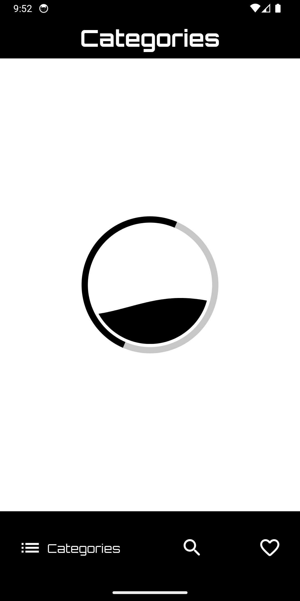
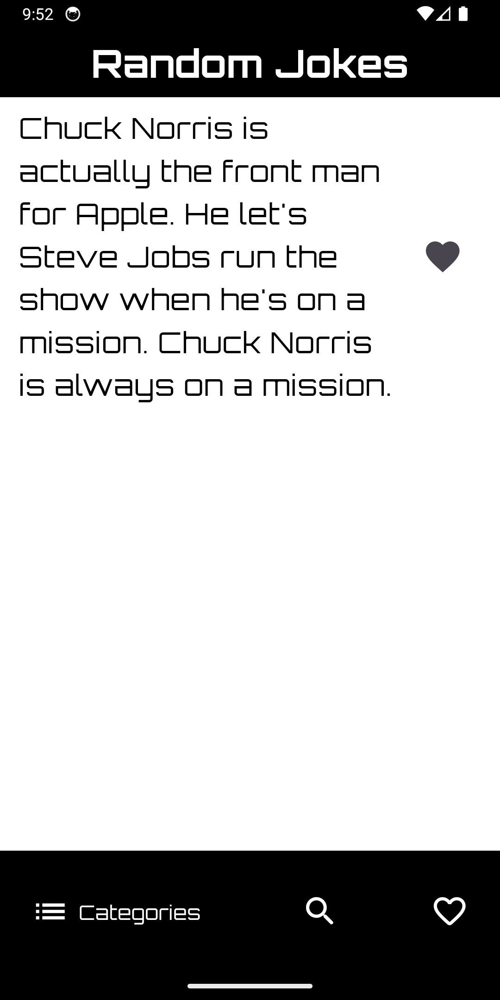
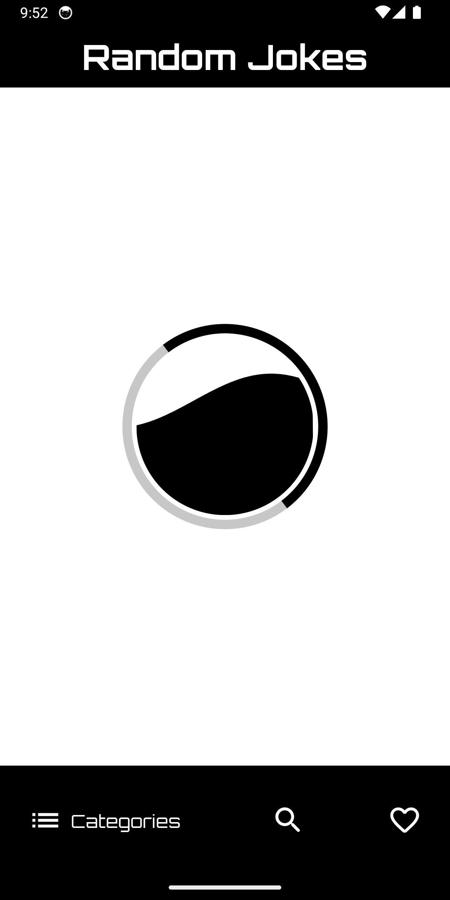
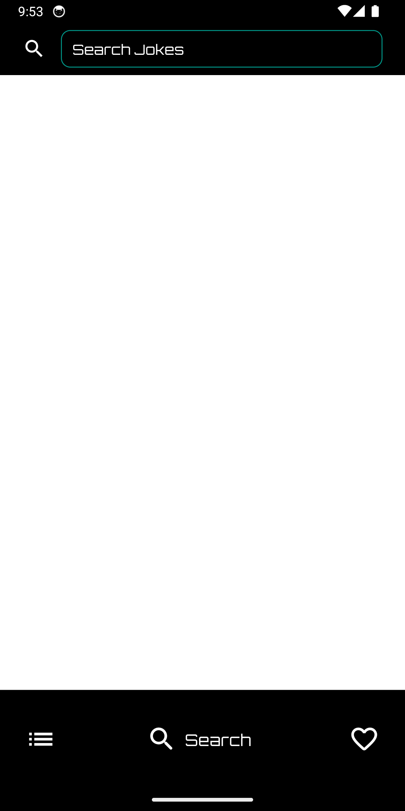
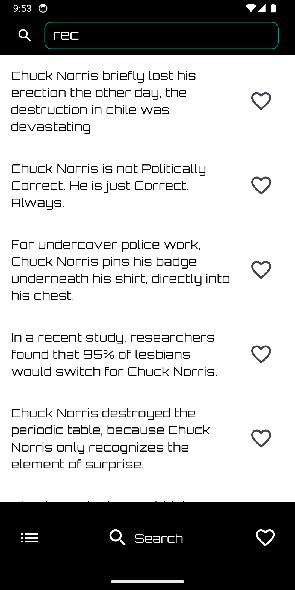
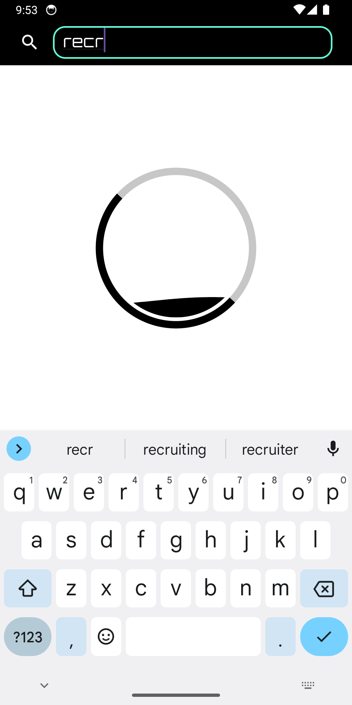
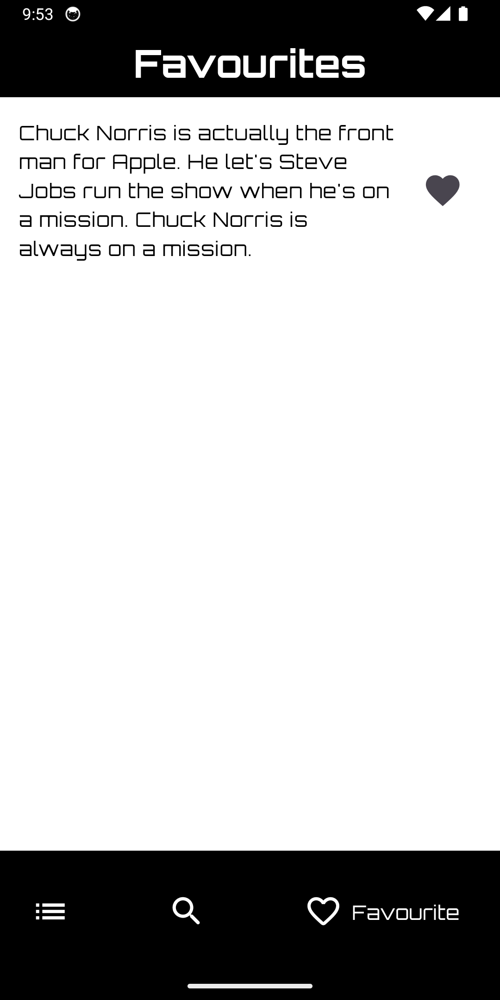
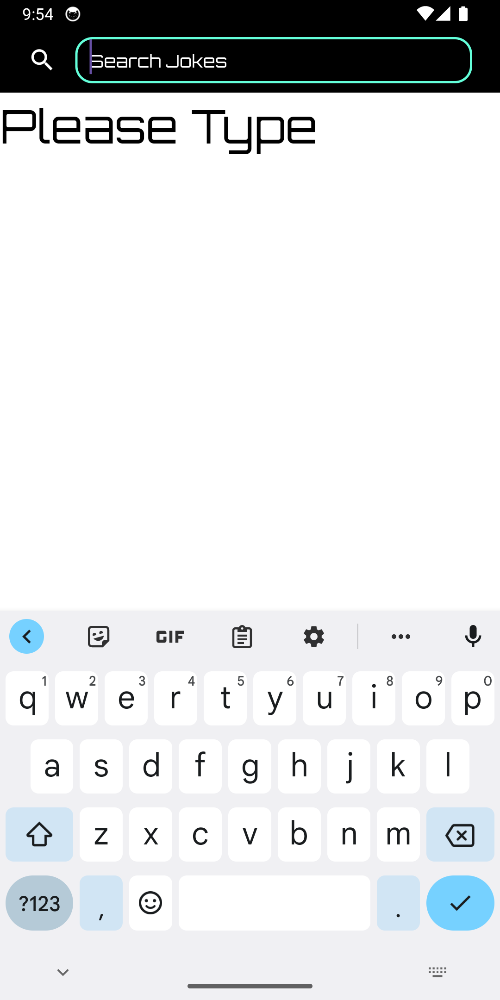
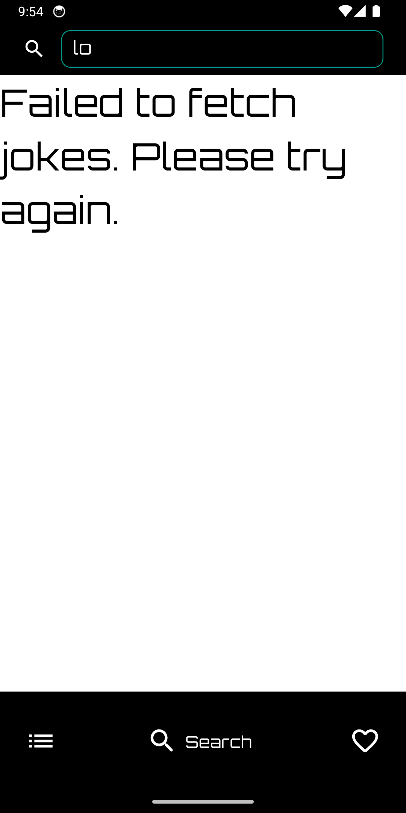

# Giggle Grid: Flutter Joke App

## Introduction
Giggle Grid is a dynamic and engaging Flutter app that brings a wide variety of jokes right to your fingertips. Powered by the Chuck Norris API, the app features an intuitive and sleek user interface, offering a seamless and enjoyable joke-browsing experience. Whether you're in the mood for a quick chuckle or a deep dive into humor, Giggle Grid has something for everyone.

## Features

### Diverse Joke Categories
- Explore jokes across multiple categories, from general humor to specific themes.
- Effortlessly navigate through different categories for a tailored joke experience.

### Advanced Search Functionality
- Utilize the powerful search feature to find jokes on any topic.
- Instantly access a vast library of jokes with a simple keyword search.

### Favorites and Like System
- Like and unlike jokes with a simple tap.
- Save your favorite jokes for quick access later, even when offline.

### Random Joke Generator
- Spice up your day with randomly selected jokes from various categories.
- A new laugh with every tap.

### Offline Access
- Liked jokes are stored locally using Hive, allowing you to enjoy them anytime, anywhere.
- Revisit your favorite jokes without the need for an internet connection.

### Responsive and Modern UI
- Enjoy a user-friendly interface with modern aesthetics and smooth navigation.
- A delightful user experience optimized for both smartphones and tablets.

### Screenshots

## Architecture
Giggle Grid uses the Model-View-ViewModel (MVVM) architecture. This architecture separates the UI (View) from the business logic and data (ViewModel), with the Model representing the data and business logic. It enhances code maintainability and testability, and it perfectly suits Flutter's reactive UI model.

## APIs Used
The app utilizes the following endpoints from the Chuck Norris Jokes API:

### Categories Endpoint: Fetches a list of joke categories.

GET https://api.chucknorris.io/jokes/categories
Random Joke by Category Endpoint: Retrieves a random joke from a specific category.

GET https://api.chucknorris.io/jokes/random?category={category}
Search Endpoint: Searches for jokes containing a specified query.

GET https://api.chucknorris.io/jokes/search?query={query}

## Technical Details

### Packages Used

- `flutter_riverpod: ^2.4.6`: State management solution that simplifies app development.
- `google_fonts: ^6.1.0`: Access to a wide range of Google Fonts for UI customization.
- `riverpod: ^2.4.6`: Complements Flutter Riverpod for state management.
- `flutter_spinkit: ^5.2.0`: Collection of animated loading indicators.
- `logger: ^2.0.2+1`: Simple yet powerful logging for Flutter.
- `hive: ^2.2.3`: Lightweight and blazing fast key-value database for local storage.
- `google_nav_bar: ^5.0.6`: Sleek and customizable navigation bar component.
- `go_router: ^12.1.1`: Declarative routing solution for Flutter.
- `dio: ^5.3.3`: Powerful HTTP client for Dart, supporting interceptors, FormData, request cancellation, file downloading, etc.
- `connectivity_plus: ^5.0.1`: Flutter plugin for discovering the state of network connectivity.
- `hive_flutter: ^1.1.0`: Extension for Hive, bringing additional Flutter-specific functionality.

### File structure

- giggle_grid/
    - lib/
        - models/
        - views/
        - view_models/
        - services/
        - common/
      

## Getting Started

### Prerequisites

Flutter SDK
Dart SDK
An IDE (preferably Android Studio or Visual Studio Code)
### Installation

### Clone the repository:
git clone https://github.com/sagnik150699/giggle_grid

### Navigate to the project directory:
cd giggle_grid

### Install dependencies:
flutter pub get

### Run the app:
flutter run

